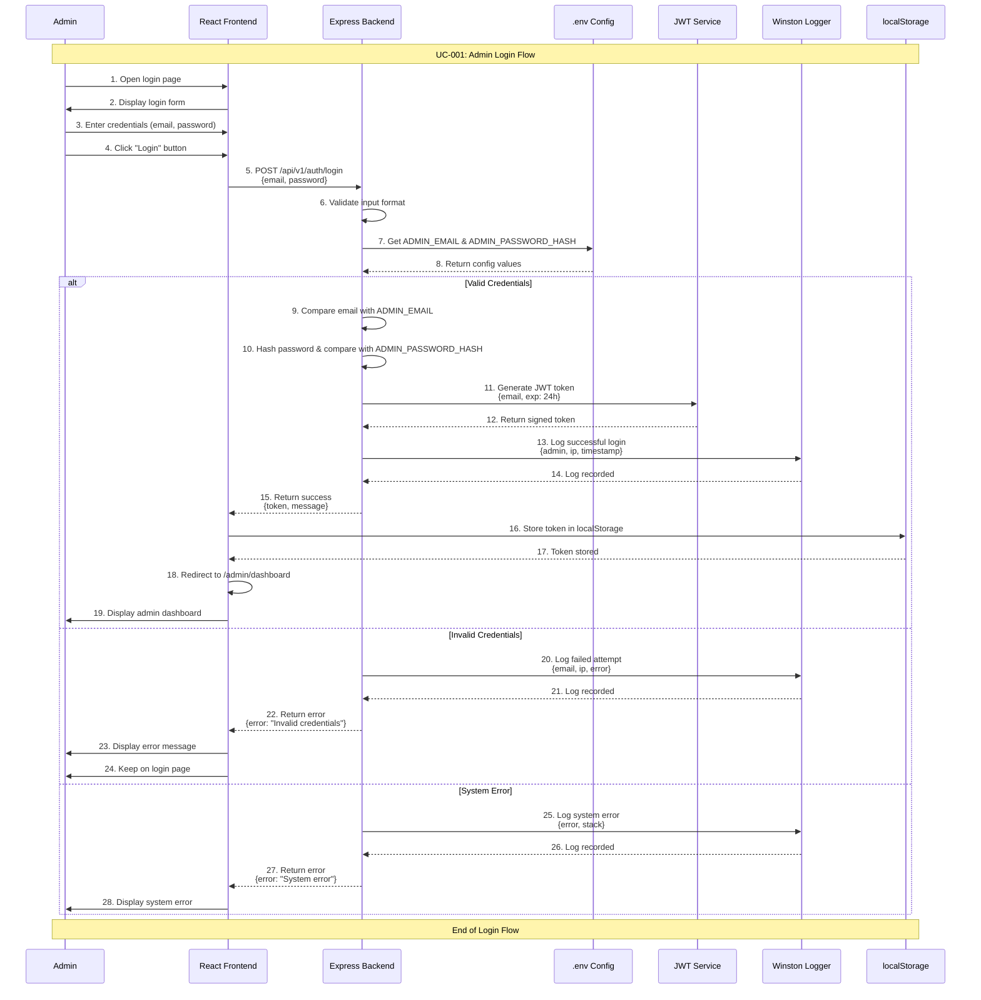

# Admin Login Use Case

## Use Case: UC-001 - Admin Authentication
**Version:** 1.0  
**Date:** January 30, 2026  
**Author:** System Architect  

---

## Use Case Description
This use case describes the process of admin authentication in the user request management system. The admin needs to authenticate using valid credentials to access the admin dashboard and manage user types, requests, and system configurations.

---

## Actors
- **Primary Actor:** Admin
- **Secondary Actor:** System (Backend Authentication Service)
- **External Systems:** .env configuration file, JWT service

---

## Preconditions
1. Admin has valid credentials (email and password)
2. Admin credentials are properly configured in `.env` file
3. System is running and accessible
4. Admin is not already logged in
5. JWT secret is configured in environment variables

---

## Postconditions

### Success Postconditions
1. Admin is successfully authenticated
2. JWT token is generated and returned to client
3. Admin gains access to dashboard
4. Login activity is logged in system logs
5. Admin session is active for 24 hours (token expiration)

### Failure Postconditions
1. Admin remains unauthenticated
2. Error message is displayed
3. Failed login attempt is logged
4. No token is generated

---

## Main Success Scenario

### Step 1: Navigate to Login Page
1. Admin opens the admin login URL
2. System displays login form with email and password fields
3. Admin sees clean, secure login interface

### Step 2: Enter Credentials
1. Admin enters email address in email field
2. Admin enters password in password field
3. Admin clicks "Login" button

### Step 3: Validate Credentials
1. System receives login request with credentials
2. Backend validates email format and password strength
3. System compares email with `ADMIN_EMAIL` from .env
4. System compares password hash with `ADMIN_PASSWORD_HASH` from .env
5. If credentials match, proceed to Step 4

### Step 4: Generate Authentication Token
1. System generates JWT token with admin payload
2. Token includes admin email and expiration time (24 hours)
3. System logs successful login with admin email and IP address
4. Token is returned to frontend

### Step 5: Redirect to Dashboard
1. Frontend receives token and stores in localStorage
2. Admin is redirected to admin dashboard
3. Dashboard displays with navigation menu for:
   - User Types Management
   - Requests Management
   - Fields Master Management
   - Database Management
   - System Statistics

---

## Alternative Flows

### AF-1: Invalid Email
**Trigger:** Admin enters invalid email format or non-existent admin email
1. System validates email format
2. System compares with configured `ADMIN_EMAIL`
3. System returns error: "Invalid credentials"
4. Failed attempt is logged with email and IP
5. Admin remains on login page
6. Return to Step 2 of main flow

### AF-2: Invalid Password
**Trigger:** Admin enters incorrect password
1. System compares password hash with `ADMIN_PASSWORD_HASH`
2. Password hash doesn't match
3. System returns error: "Invalid credentials"
4. Failed attempt is logged with email and IP
5. Admin remains on login page
6. Return to Step 2 of main flow

### AF-3: System Configuration Error
**Trigger:** Missing or invalid environment variables
1. System cannot read `ADMIN_EMAIL` or `ADMIN_PASSWORD_HASH` from .env
2. System returns error: "System configuration error"
3. Error is logged in system logs
4. Admin cannot proceed with login
5. System administrator must fix configuration

### AF-4: Token Generation Failure
**Trigger:** JWT service fails to generate token
1. Credentials are valid but token generation fails
2. System returns error: "Authentication service unavailable"
3. Error is logged with technical details
4. Admin cannot proceed to dashboard
5. Return to Step 2 of main flow

---

## Exception Flows

### EF-1: Rate Limiting
**Trigger:** Too many failed login attempts from same IP
1. System detects multiple failed attempts (>5 in 15 minutes)
2. IP address is temporarily blocked
3. System returns error: "Too many attempts. Please try again later"
4. Blocking event is logged
5. Admin must wait before next attempt

### EF-2: Network Connectivity Issues
**Trigger:** Network connection problems
1. Request fails due to network issues
2. Frontend displays connection error
3. Admin can retry when connection is restored

---

## Sequence Diagram



---

## Data Flow

### Input Data
```json
{
  "email": "admin@site.com",
  "password": "adminPassword123"
}
```

### Processing Data
- Email validation (format check)
- Password hashing (bcrypt)
- Environment variable lookup
- JWT token generation

### Output Data (Success)
```json
{
  "success": true,
  "message": "Login successful",
  "token": "eyJhbGciOiJIUzI1NiIsInR5cCI6IkpXVCJ9...",
  "expiresIn": "24h",
  "admin": {
    "email": "admin@site.com",
    "role": "admin"
  }
}
```

### Output Data (Failure)
```json
{
  "success": false,
  "error": "Invalid credentials",
  "message": "Please check your email and password"
}
```

---

## Technical Requirements

### Environment Configuration
```env
ADMIN_EMAIL=admin@site.com
ADMIN_PASSWORD_HASH=$2b$12$...
JWT_SECRET=your-super-secret-jwt-key
JWT_EXPIRES_IN=24h
```

### API Endpoint
- **Method:** POST
- **URL:** `/api/v1/auth/login`
- **Content-Type:** `application/json`
- **Rate Limit:** 5 attempts per 15 minutes per IP

### Security Measures
1. **Password Hashing:** bcrypt with salt rounds = 12
2. **JWT Security:** RS256 or HS256 algorithm
3. **Input Validation:** Joi schema validation
4. **Rate Limiting:** Express rate limiter
5. **HTTPS Only:** Secure token transmission
6. **Secure Headers:** Helmet.js security headers

### Database Logging
```sql
-- Example log entry structure
{
  "timestamp": "2026-01-30T10:15:30Z",
  "level": "info",
  "action": "admin_login_success",
  "admin_email": "admin@site.com",
  "ip_address": "192.168.1.100",
  "user_agent": "Mozilla/5.0...",
  "session_duration": "24h"
}
```

---

## Business Rules

### BR-1: Single Admin Account
- System supports only one admin account configured in .env
- No multiple admin users or role-based permissions
- Admin credentials are environment-based, not database-stored

### BR-2: Token Expiration
- JWT tokens expire after 24 hours
- Admin must re-authenticate after token expiration
- No refresh token mechanism (keep it simple)

### BR-3: Session Management
- Only one active session per admin (stateless JWT)
- No concurrent admin sessions tracking
- Token invalidation only through expiration

### BR-4: Audit Trail
- All login attempts (success/failure) must be logged
- Include IP address, timestamp, and user agent
- Failed attempts should include reason for failure

---

## Success Criteria

### Functional Success Criteria
1. ✅ Admin can login with valid credentials
2. ✅ System rejects invalid credentials
3. ✅ JWT token is generated and returned
4. ✅ Admin gains access to dashboard
5. ✅ All login attempts are logged

### Non-Functional Success Criteria
1. ✅ Login process completes within 2 seconds
2. ✅ System handles rate limiting properly
3. ✅ Security headers are applied
4. ✅ Password is never stored in plain text
5. ✅ Token is stored securely in browser

---

## Testing Scenarios

### Test Case 1: Valid Login
**Input:** Correct email and password  
**Expected:** Success response with JWT token  
**Verification:** Admin can access dashboard  

### Test Case 2: Invalid Email
**Input:** Wrong email, correct password  
**Expected:** "Invalid credentials" error  
**Verification:** Admin stays on login page  

### Test Case 3: Invalid Password
**Input:** Correct email, wrong password  
**Expected:** "Invalid credentials" error  
**Verification:** Failed attempt is logged  

### Test Case 4: Rate Limiting
**Input:** 6 failed attempts in 10 minutes  
**Expected:** IP blocked temporarily  
**Verification:** Subsequent requests blocked  

### Test Case 5: Token Validation
**Input:** Request to protected route with valid token  
**Expected:** Access granted  
**Verification:** Dashboard loads successfully  

---


## Related Use Cases
- **UC-002:** Admin Dashboard Navigation
- **UC-003:** Admin Token Validation
- **UC-004:** Admin Session Management
- **UC-005:** Admin Logout Process

---

## Dependencies
- Express.js framework
- JWT library (jsonwebtoken)
- bcrypt for password hashing
- Winston for logging
- Joi for validation
- Environment configuration (.env)

---

*This use case document follows the system architecture described in the mindset document and implements the admin authentication flow as specified in the detailed flow diagrams.*
